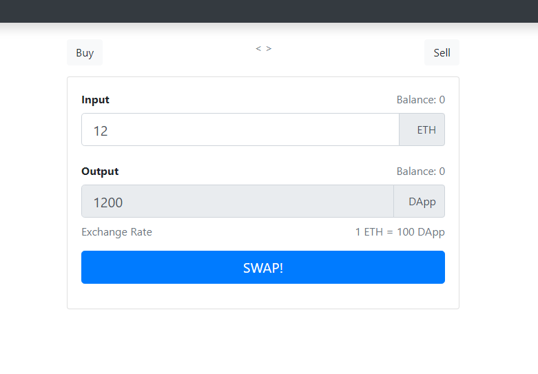

#  EthSwap

EthSwap is my practice project while learning Web3. The original idea and code was presented by [Dapp University][DappUniversity].
This is a Uniswap-like exchange where you could exchange Eth for a custom token called 'Dapp'. The exchange rate is fixed to 100: for every Eth you'd receive 100 Dapp tokens. Basically, I just followed the tutorial and made this project.

## Preview

 


## Installation

Inside root directory:

```bash
npm run i
truffle compile
truffle migrate
npm run start
```
>\* You need to have Ganache installed on your system. Or otherwise, you could use real Ethereum network or even test networks.

[DappUniversity]:https://www.youtube.com/c/DappUniversity


